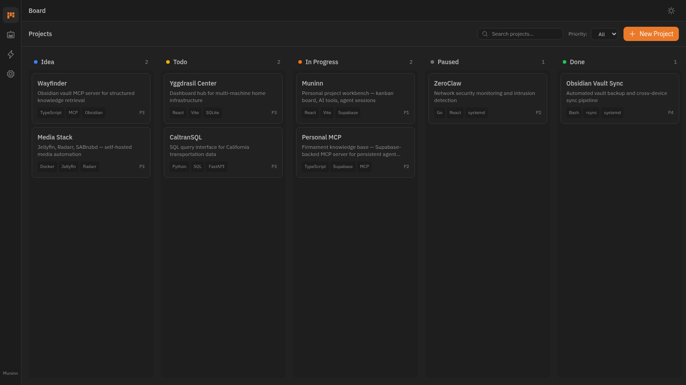

# Muninn 🐦‍⬛

> Personal project workbench for solo vibe coders. Kanban board, AI tool tracking, agent session history — backed by [Firmament](https://github.com/alecvdp/personal-mcp) (Supabase).

Named for Odin's raven of memory.



## What it does

Muninn gives you one place to manage your projects, track AI subscriptions, and review what your agents have been doing — across every machine.

- **Board** — Kanban board with drag-and-drop, filtering, search, and project archiving
- **Tools** — AI subscription tracker with cost summaries and renewal alerts
- **Agents** — Paginated session history with interface/machine filters
- **Settings** — Connection status, theme toggle, version info

All data lives in your Supabase instance (Firmament) with realtime sync across tabs and machines.

## Tech stack

| Layer | Choice |
|---|---|
| UI | React 19 + Vite |
| Styling | Tailwind CSS + HSL CSS variables |
| State | Zustand (devtools + persist) |
| Backend | Supabase (`@supabase/supabase-js`) |
| Drag & drop | `@hello-pangea/dnd` |
| Panels | `react-resizable-panels` |
| Icons | `@phosphor-icons/react` |
| Fonts | IBM Plex Sans + IBM Plex Mono |
| Router | React Router v7 |
| Tests | Vitest + Testing Library |

## Getting started

### Prerequisites

- Node.js 18+
- A Supabase project (the app uses anon key auth — no login required)

### Install

```bash
git clone https://github.com/alecvdp/muninn.git
cd muninn
npm install
```

### Configure

```bash
cp .env.example .env
```

Edit `.env` with your Supabase credentials:

```
VITE_SUPABASE_URL=https://your-project.supabase.co
VITE_SUPABASE_ANON_KEY=your-anon-key-here
```

### Database setup

Muninn reads from four Firmament tables. If you're starting fresh, apply these migrations to your Supabase project:

**Projects table** (add kanban columns):
```sql
alter table projects
  add column if not exists board_status text default 'idea',
  add column if not exists board_position integer default 0,
  add column if not exists archived_at timestamptz;
```

**Tools table** (new):
```sql
create table tools (
  id uuid primary key default gen_random_uuid(),
  name text not null,
  category text not null default 'to-check-out',
  cost numeric(10,2) default 0,
  billing_cycle text,
  renewal_date date,
  platform text[] default '{}',
  url text,
  tags text[] default '{}',
  notes text default '',
  created_at timestamptz default now(),
  updated_at timestamptz default now()
);

alter table tools enable row level security;
create policy "Allow all access" on tools for all using (true) with check (true);
```

**Enable realtime** (for live sync):
```sql
alter publication supabase_realtime add table projects;
alter publication supabase_realtime add table tools;
```

The `agent_sessions` and `memories` tables are managed by [personal-mcp](https://github.com/alecvdp/personal-mcp) — Muninn reads from them but doesn't write.

### Run

```bash
npm run dev
```

Open `http://localhost:5173`.

## Available scripts

| Command | What it does |
|---|---|
| `npm run dev` | Start dev server (Vite, port 5173) |
| `npm run build` | Type-check with tsc, then build for production |
| `npm run preview` | Preview the production build locally |
| `npm run lint` | Run ESLint |
| `npm test` | Run tests (Vitest, 123 tests) |
| `npm run test:watch` | Run tests in watch mode |

## Project structure

```
muninn/
├── src/
│   ├── components/
│   │   ├── agents/         # SessionFeed, SessionCard
│   │   ├── board/          # KanbanBoard, KanbanColumn, ProjectCard
│   │   ├── detail/         # ProjectDetail, ToolDetail, CreateProjectDetail
│   │   ├── layout/         # AppBar, Navbar, DetailPanel
│   │   ├── tools/          # ToolsGrid, ToolCard
│   │   └── ui/             # ErrorBoundary, ErrorToast
│   ├── lib/
│   │   ├── supabase.ts     # Typed Supabase client
│   │   └── dates.ts        # Date utilities (renewal checks)
│   ├── pages/
│   │   ├── BoardPage.tsx   # Kanban with search/filter/archive
│   │   ├── ToolsPage.tsx   # Tool grid with cost summary
│   │   ├── AgentsPage.tsx  # Session feed with filters
│   │   ├── SettingsPage.tsx
│   │   └── NotFoundPage.tsx
│   ├── store/
│   │   ├── projects.ts     # Projects CRUD, kanban state, realtime
│   │   ├── tools.ts        # Tools CRUD, cost calculations, realtime
│   │   ├── sessions.ts     # Sessions with pagination + server-side filters
│   │   └── ui.ts           # Panel state, theme (persisted)
│   ├── types/
│   │   └── index.ts        # Shared row/insert/update types
│   ├── database.types.ts   # Generated Supabase schema types
│   ├── App.tsx             # Layout shell (AppBar + Navbar + Outlet + DetailPanel)
│   ├── main.tsx            # Router + ErrorBoundary
│   └── index.css           # CSS variables, dark/light themes
├── supabase/
│   └── migrations/         # SQL migrations
├── docs/
│   └── screenshot.png
├── SPEC.md                 # Original design spec
├── .env.example
├── vite.config.ts
├── vitest.config.ts
├── tailwind.config.js
└── package.json
```

## Layout

```
┌──────┬─────────────────────────────────────────────┐
│      │  Navbar  (view title, theme toggle)         │
│ App  ├──────────────────────┬──────────────────────┤
│ Bar  │                      │                      │
│      │  Main Content        │  Detail Panel        │
│ 48px │  (board / tools /    │  (440px, resizable,  │
│      │   agents / settings) │   opens on click)    │
│      │                      │                      │
└──────┴──────────────────────┴──────────────────────┘
```

- **AppBar** — Icon rail on the left. Board, Tools, Agents, Settings.
- **Navbar** — Top bar with view title and theme toggle.
- **Detail Panel** — Slides in from the right when you click a card. Escape to close. Focus-trapped for accessibility.

## Board view

The home view. Projects displayed as cards in kanban columns:

| Column | Status | Color |
|---|---|---|
| Idea | `idea` | Blue |
| Todo | `todo` | Yellow |
| In Progress | `in-progress` | Orange |
| Paused | `paused` | Gray |
| Done | `done` | Green |

**Features:**
- Drag cards between columns to change status
- Reorder within columns (fractional positioning, handles filtered views)
- Search by name/description
- Filter by priority (P1–P5)
- Toggle archived projects visibility
- Click any card to edit in the detail panel
- Create new projects with the + button

## Tools view

Track AI subscriptions and tools you're evaluating.

**Summary stats bar** at the top shows:
- Total monthly cost
- Total annual cost
- Active tool count
- Tools renewing within 30 days (highlighted)

**Each tool card** shows name, category badge (Using/To Check Out), cost, billing cycle, platform icons, renewal date, and tags.

**Filters:** Search by name, filter by category, filter by platform.

## Agents view

Chronological feed of agent sessions from the `agent_sessions` table.

- Sessions grouped by date
- Paginated (25 per page, "Load more" button)
- Filter by interface (claude-code, claude.ai, amp, etc.)
- Filter by machine (midgard, mini-ygg, etc.)
- Server-side filtering (queries pushed to Supabase, not client-side)

## Theming

Dark and light themes via CSS variables. Toggle in the navbar or Settings page. Theme preference persists in localStorage.

Colors use HSL format for easy customization — edit `src/index.css` to adjust:

```css
:root {
  --brand: 25 82% 54%;      /* Warm orange accent */
  --bg-surface: 0 0% 13%;   /* Main background */
  --bg-muted: 0 0% 11%;     /* Sidebar, panels */
  --text-normal: 0 0% 77%;  /* Body text */
}
```

Kanban column colors and tool category badges use semantic CSS variables (`--status-idea`, `--category-using`, etc.) so themes stay consistent.

## Realtime sync

Projects and Tools use Supabase Realtime channels. Changes on one machine appear instantly on others — no refresh needed.

The subscription lifecycle uses a global registry pattern to survive Vite HMR without orphaning channels. Each store tracks subscriber count and only removes the channel when the last consumer unmounts.

## Deployment

Build and deploy as a static site:

```bash
npm run build
```

The `dist/` folder can go to Cloudflare Pages, Vercel, Netlify, GitHub Pages, or any static host. Set `VITE_SUPABASE_URL` and `VITE_SUPABASE_ANON_KEY` as environment variables in your hosting platform.

## Troubleshooting

**App crashes on load with "Missing Supabase environment variables":**
You need a `.env` file. Copy `.env.example` to `.env` and fill in your Supabase project URL and anon key.

**Projects don't sync between tabs/machines:**
Check that the `supabase_realtime` publication includes the `projects` table. Run:
```sql
alter publication supabase_realtime add table projects;
```

**Drag and drop feels janky after many reorders:**
Fractional positioning can accumulate precision issues over time. A future improvement would normalize positions periodically.

**Build warns about chunk size:**
The 660KB bundle is primarily `@hello-pangea/dnd` + Supabase client. Code splitting via `React.lazy()` is tracked as a future improvement.

## Design references

Muninn's visual design and component architecture are heavily inspired by [Vibe Kanban](https://github.com/barvian/vibe-kanban):
- Three-zone layout (AppBar + main + detail panel)
- Card styling with border overlap trick
- HSL color token system
- IBM Plex typography
- Phosphor icon set

Full design spec: [SPEC.md](SPEC.md)

---

> *"Muninn and Huginn fly each day over the spacious earth. I fear for Huginn, that he come not back, yet more anxious am I for Muninn."* — Odin

MIT License — Built for solo builders who ship.
